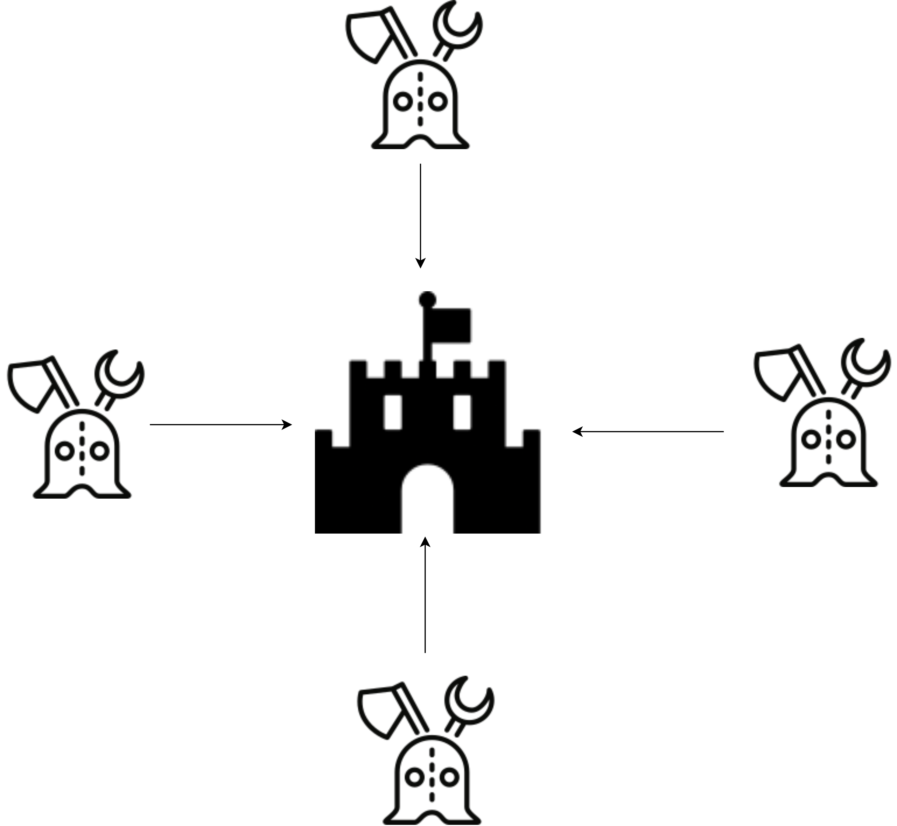

## What is Byzantine generals problem

Byzantine generals problem states suppose you are attacking a fort for different sides, how can all the general in all sides of fort come to the consensus that everyone will attack the fort at the same time

Let's say, you pass message through soldier from your side with the time of the attack to the rest of the 3 sides, how do you know that message was reached, how do we know that message was not infiltrated in between. Let's say you confirm if the message was reached only after getting a reply how do you know that the reply is legitimate? How can other general trusts the source etc

This is an unsolved problem until bitcoin was created.
Bitcoin claims to have solved this problem