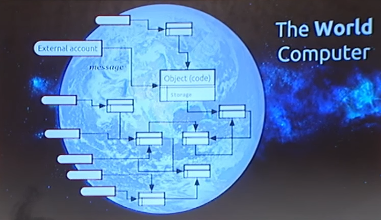

Notes from [Ethereum for Dummies - Dr. Gavin Wood](https://www.youtube.com/watch?v=U_LK0t_qaPo&ab_channel=Ethereum)  

* What is Ethereum:  
	* It is a single global computer  
	* Global singleton computer  
	* All computers are generally physical or virtual that resides in one of the physical computer  
	* ETH Computer does not resides in any physical yet there is one  
	* There is no reset button, no stop button  
	* Ubiquitous: Access to Internet -> Access to ETH  
	* Multi user:  
		* No limit on user account  
		* Object oriented, encapsulation is built in, code has data  
		* Accessible easily  
	* Easily verifiable and auditable  
	* Replay everything in past and get the same result  
  

<i>Image source: https://www.youtube.com/watch?v=U_LK0t_qaPo&ab_channel=Ethereum </i>

* Boxes: Accounts -> Objects getting executed in ETH environment  
* Side boxes: External account, objects from which messages get injected  
  
Once you get in no way out, only way in is external account  
  
  
Guarantees:  
* Atomicity:        Either transaction is succeeded else not  
* Synchronous:  No need to think about threading, shared process etc  
* Provenance:     All the messages can be inspected to see the source of the message, These guarantees allows to build security
* Permanence:    Objects data is lasts forever, does not change when computer goes off
* Immortal:          Object cannot be deleted
* Immutability:    Objects codes can never be changed

Servers are Walled Garden (?) -> Monopoly

Does not give false security, no data is places in the third part server (?)

Authenticity -> No third party server auth you, you have private key to get auth

Because of decentralised:
* No Single point of failure, control, bottelneck in ***principle***

Ethereum is an innovation to conmands, anyone can build on it and make business out of it
Platform for zero trust computing 

Questions:
1. Private vs Public Chain ?