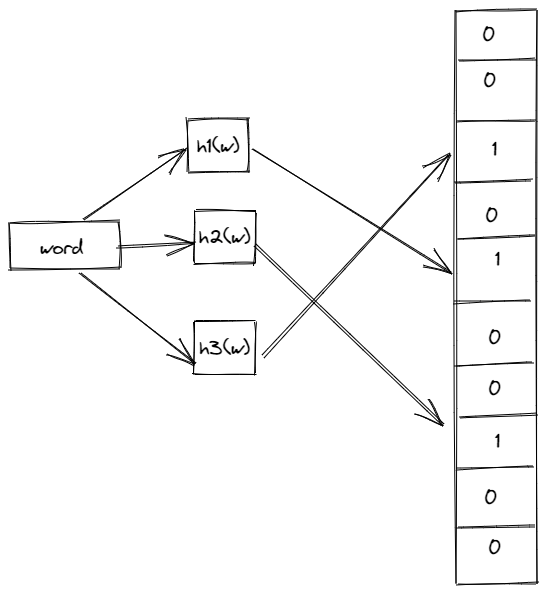
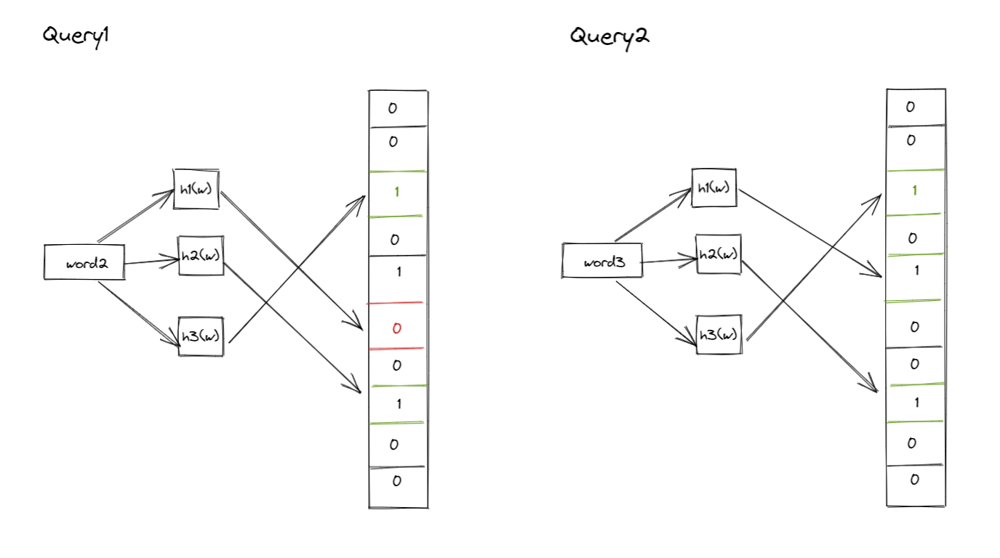

# [02-12-2021] Understanding Bloom Filter

Landed into this amazing blog [post](https://michaelnielsen.org/ddi/how-to-crawl-a-quarter-billion-webpages-in-40-hours/) where the author explains about crawling a quarter billion webpage in 40 hours

In this post author used Bloom Filter to capture if the web page is already crawled.

 What is a bloom filter?
- Given an input bloom filter returns if the input is present or not. Or rather a bloom filter may return if the key is present or not. This is because the bloom filter can return a false positive. More on this later in the post
* In this particular use case where the author wanted to store all the web pages already crawled, he is using bloom filter to figure it out.
- Advantage: You don't need a lot of space to store data, you can have an in-memory datastore. The size of the datastore is known prior in the case of bloom filter

### How does bloom filter works
 

Given a word, it goes through the sequence of hash functions, set the bloom filter bit based on the output of the hash

Example:
* h1("word") % 10 = 2
* h2("word") % 10 = 4
* h3("word") % 10 = 7

We set 2,4 and 7th bits in the bloom filter

#### Querying

 

In case we need to check if the word exists we can do the same set of functions again, if we get all the bits as 1 then the word may exist else it does not exist

There are chances of false positives, bloom filter can return a word that exists even though the word might not be present. But it never returns true negatives where it returns word that does not exist but it exist. This is because bloom filter properties like fixed size and word can never be deleted once recorded in the bloom filter.

Generally, there will be a second layer to check if the word exists if the bloom filter says exists.