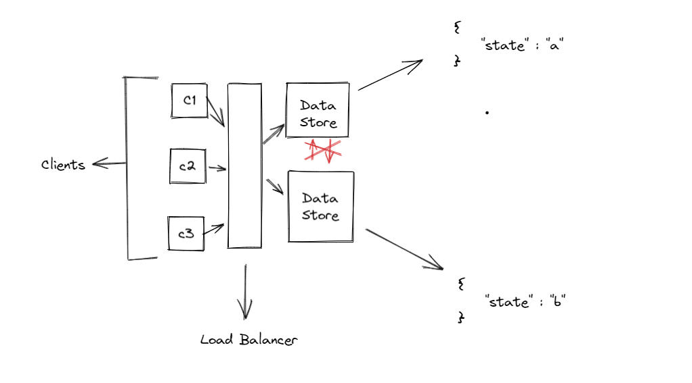

# Understanding Raft

## Split brain problem

* Consider a scenerio where there are multiple data store for high avilablity, continious replication is happening b/w these data store. Client can connect to ant data store and preform operation
  

* Due to some netwok glitch replication b/w 2 data store stooped for a moment, `but both the data stores continue to work independently`

* Before replication can continue, lets say we got request to update state from multiple clients, one the client updates state to `a` and another client updates state to `b` 

* Since both the data store are unabled to replicate, they will diverge and no longer be consistenct. This is known as split brain

## Raft

There are many known concensus algorith that aims in solving this problem, like Paxos etc. Raft aims in simplifying the alogrithm so that it can easy to understand and implement

Consensus algorith aims in manaing the `state` (log repication across all the nodes)

Keeping the replicated log consistent is the job of the consensus algorithm. It should be able to operate if majority of the nodes are running

Three main features:
* Leader election: When existing leader fails, new leader must be choosen
* Log replication: Leader is the entry point for log entris from client, it responsible for replicating log across all the other nodes
* Safety: At a given index all the server should have same entry in the log

 
 

* At any given moment a server can be in one of the states -> `Leader`, `Follower`, `Candidate`
* Followers are passive does not receive any traffic
* Term: One end to end cycle. Election -> New Leader -> Until a new election
* Term ID: Incrementing Id

