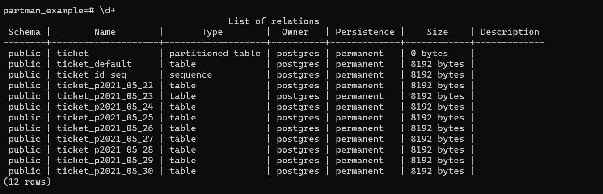

# [26-05-2021] Setting up Partman - Postgres

# What is partitioning?

Splitting up the large table into a logical group of subtables

There are multiple ways data can be partitioned.

- Time-based
- Serial based

### Why is it required?

- Query performance can be improved
- Data deleting can be made easier
- Good control to users. User can create different triggers and index on the partitioned tables

### What is Partman?

[Partman](https://github.com/pgpartman/pg_partman) is a Postgres extension to maintain both serial and time-based partitioning.

### How to do table partitioning?

Consider we have a table for ticket management called `ticket`. It has following columns

- id - Auto increment
- status - Text
- created_at - Date

Use case is we have to partition table such that we need to store tickets day wise

```sql
create table ticket (id serial, status text, created_at date) partition by range (created_at);
```

Partion by range will create a partition table


Create child tables for the parent partition tables

```sql
create table ticket_2021_05_16 partition of ticket for values from ('2021-06-16 00:00:00')
 to ('2021-06-17 00:00:00');create table ticket_2021_05_17 partition of ticket for values
 from ('2021-06-17 00:00:00') to ('2021-06-18 00:00:00');
```


Lets try to insert data

```sql
INSERT INTO public.ticket (status, created_at) VALUES('PASS', '2021-06-17');

INSERT INTO public.ticket (status, created_at) VALUES('PASS', '2021-06-16');
```

We have inserted 2 tickets one on date 17th and one more on 16th

Let’s try and query `ticket` table


We can see both the records are in ticket table

Now lets query child tables


Since partition was created per dat basis, we can see record which was created_at 17th is in ticket_2021_05_17 table and 16th is in ticket_2021_05_16 th table.

# Partman

Cosider a use case where we need to keep only last 2 days record and delete old records regularly and created new tables for next day

Lets create more partitions for this use case

```sql
create table ticket_2021_05_14 partition of ticket for values from ('2021-06-14 00:00:00') 
to ('2021-06-15 00:00:00');
create table ticket_2021_05_15 partition of ticket for values from ('2021-06-15 00:00:00') 
to ('2021-06-16 00:00:00');
```

Add some data to the partition tables

```sql
INSERT INTO public.ticket (status, created_at) VALUES('PASS', '2021-06-14');
INSERT INTO public.ticket (status, created_at) VALUES('PASS', '2021-06-15');
```


To support our use case where we need to delete old partition tables and create new tables for upcoming days

We can do that using multiple way

- We can write a corn that supports this use case
- Use scheduler pg_agent where you will execute a procedure every day at say

And many other ways which are either difficult to setup or maintain

This is where we can use partman to setup. Advantages are as below

- Easy to setup and maintain
- Easy to run scheduled clean up
- Configurable parameters like number of Backups, numbers of tables to create for future use, interval to run the BGW and much more

### Installation

- `git clone git@github.com:pgpartman/pg_partman.git`
- `make install`

### Setup

- Create partman schema
    
    ```sql
    CREATE SCHEMA IF NOT EXISTS partman;
    ```
    
- Create table
    
    ```sql
    create table ticket (id serial, status text, created_at date) partition by range 
    (created_at);
    ```
    
- Setting partman config for the table
    
    ```sql
    SELECT partman.create_parent('public.ticket', 'created_at', 'native', 'daily');
    ```
    
    Parameters:
    
    - Parent table name
    - Partition key
    - Type of partman
    - Parition interval
    
    We should be seeing following tables now:
    
    
    
    
    
    We can also see partman config
    
    ```sql
    select * from partman.part_config;
    ```
    
    
    
    Most of the values are default values. Few of the fields which might be handy are
    
    [Partman configs](https://www.notion.so/4eff86b4a60a41de902dc2eff6204762)
    

- Setting up retention

```sql
update partman.part_config set retention = '1 days' and retention_keep_table= false and infinite_time_partitions = true;
```

- Setting up background worker
    
    Update the following config in postgresql.conf
    
    ```yaml
    shared_preload_libraries = 'pg_partman_bgw'  # Change requires restart
    pg_partman_bgw.interval = 30                 # How often to run background worker (in seconds)
    pg_partman_bgw.dbname = ''                   # Name of the database on which partman background worker should run
    ```
    

### Testing

- We can insert some sample data
    
    ```sql
    INSERT INTO public.ticket (status, created_at) VALUES('PASS', '2021-05-22');
    INSERT INTO public.ticket (status, created_at) VALUES('PASS', '2021-05-22');
    INSERT INTO public.ticket (status, created_at) VALUES('PASS', '2021-05-22');
    INSERT INTO public.ticket (status, created_at) VALUES('PASS', '2021-05-22');
    
    INSERT INTO public.ticket (status, created_at) VALUES('PASS', '2021-05-23');
    INSERT INTO public.ticket (status, created_at) VALUES('PASS', '2021-05-24');
    INSERT INTO public.ticket (status, created_at) VALUES('PASS', '2021-05-25');
    INSERT INTO public.ticket (status, created_at) VALUES('PASS', '2021-05-26');
    ```
    
    
    
- Once background worker runs we should be able see `ticket_p2021_05_22` till `ticket_p2021_05_25` to be deleted as we have configured retention to be 1 day
    
    
    
    

# Closing Notes

- Partam is easy to configure and maintain
- It can be used to extend other functionality like archiving old data in backup database
- With newer version of postgres (PG 13+) we can setup streaming replication + partman
